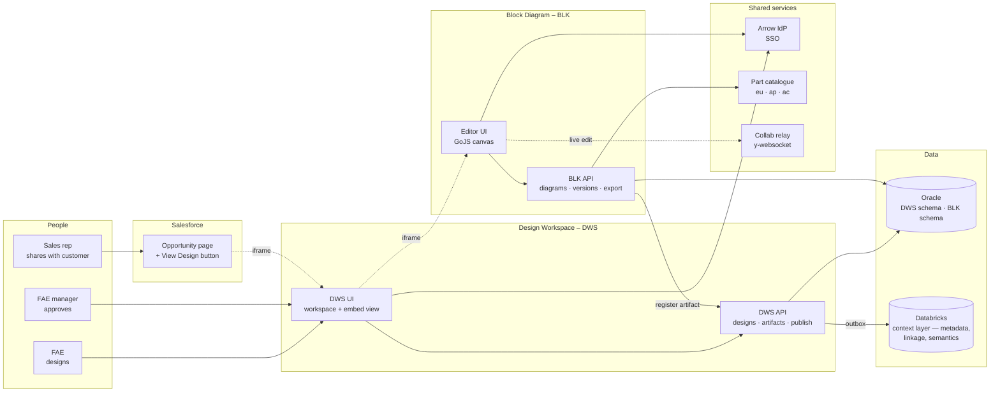
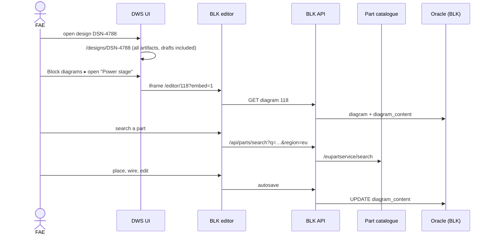
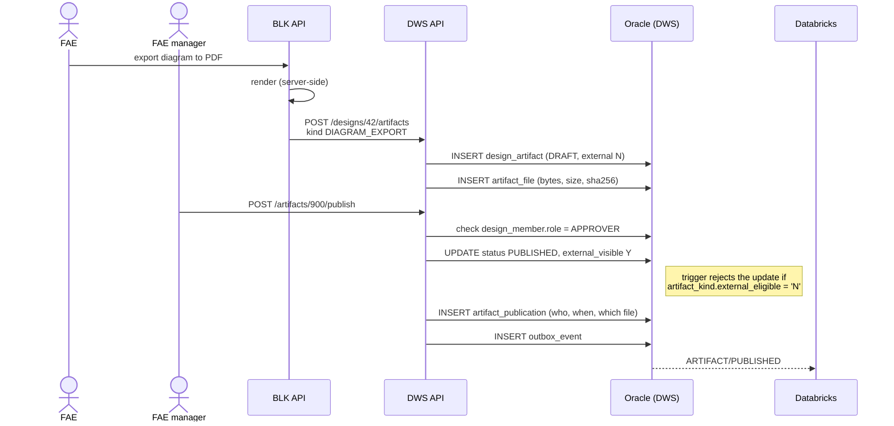
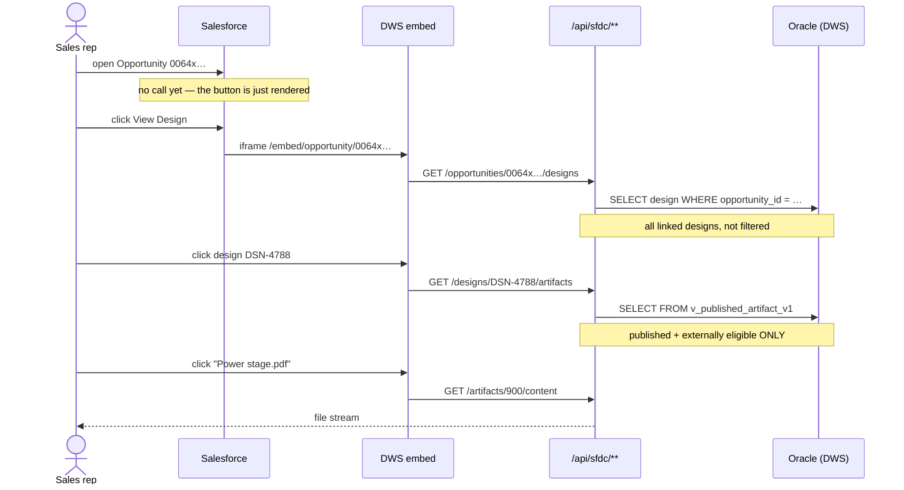
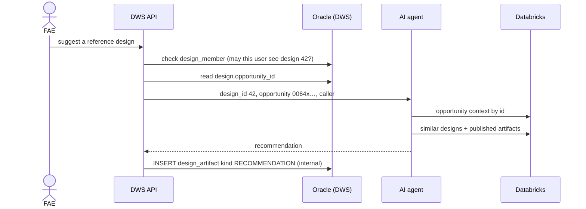

# DWS + Block Diagram + Salesforce — who does what

Companion to [data-model.md](./data-model.md). That one covers the tables; this
one covers the systems, the people, and the flows between them.

---

## 1. The landscape



Solid arrows are calls. Dotted arrows are embeds or sockets.

---

## 2. Who owns what

| Concern | Owner | Notes |
|---|---|---|
| Opportunity data (account, amount, stage) | **Salesforce** | Never copied into DWS |
| Opportunity ↔ design link | **DWS** | `design.opportunity_id`, the single link |
| Design record and its categories | **DWS** | Point 6 |
| Artifacts, publish state, approval | **DWS** | Point 5 |
| Artifact bytes | **DWS** | `artifact_file` |
| Diagram JSON and versions | **BLK** | BLK never sees an opportunity id |
| Canvas rendering, export | **BLK** | GoJS |
| Part catalogue lookups | **Arrow catalogue** | Per region: eu / ap / ac |
| Live collaboration | **Collab relay** | Off in the SFDC embed |
| AI context + recommendations | **Databricks + agent** | Points 3 and 4 |
| Design metadata, linkage, AI summaries/tags | **Databricks** | Copies, for retrieval — not the record |
| Identity | **Arrow IdP** | Both apps, same SSO |

The rule from the data model, restated: **each service writes only its own
schema.** BLK registers artifacts by calling the DWS API, never by INSERT.

**Databricks is not the artifact store.** The stakeholder review corrected this
explicitly: diagram JSON, canvas objects, versions and attachment bytes stay in
Oracle. What flows to Databricks is *linkage* (design ↔ opportunity ↔ artifact
ids), *design metadata* (name, brief, customer, region, stage) and *derived
semantics* (AI summaries, tags, embeddings). Databricks is the unified business
context layer the agent retrieves from — aggregating Salesforce, FAST,
SiliconExpert and the engineering knowledge base alongside this feed. `dws.design`
and `dws.design_artifact` remain the system of record; if Databricks were
rebuilt from scratch tomorrow, no design would be lost.

---

## 3. Flow — FAE links an opportunity

The only proactive Salesforce call in the whole system, and it happens once.

```mermaid
sequenceDiagram
  actor FAE
  participant DWS as DWS API
  participant SF as Salesforce API
  participant ORA as Oracle (DWS)
  participant DBX as Databricks

  FAE->>DWS: create design "48V BMS"
  DWS->>ORA: INSERT design (no opportunity yet)
  FAE->>DWS: link opportunity 0064x…
  DWS->>SF: GET opportunity 0064x…  (validate it exists)
  SF-->>DWS: 200 name, stage
  DWS->>ORA: UPDATE design SET opportunity_id
  DWS->>ORA: INSERT outbox_event
  ORA-->>DBX: DESIGN/LINKED
  Note over DWS,DBX: Only the id is stored.<br/>Account, amount, close date stay in SFDC;<br/>the agent resolves them from Databricks.
```

---

## 4. Flow — FAE builds the design



Region matters here: the same part number gives different stock, lead time and
price per region, so the catalogue call carries the design's region.

---

## 5. Flow — export, then publish

Two separate steps, deliberately. Exporting produces a draft; only a person with
the approver role makes it customer-visible.



The diagram **JSON** is kind `BLOCK_DIAGRAM`, which is `external_eligible = 'N'`
— it can never be published outward. The **PDF** is `DIAGRAM_EXPORT`, which can.
That is point 5, enforced by the database rather than by convention.

---

## 6. Flow — sales rep views it from Salesforce

Three calls, each one triggered by a click. Nothing happens until the rep asks.



If the rep is an FAE who wants to edit, the embed offers **Open in Design
Workspace**, which opens `dws.arrow.com/designs/DSN-4788` in a new top-level
tab — outside the iframe entirely. The stakeholder review confirmed this:
embedded = read-only summary, editing happens undocked. Salesforce has no
floating-dock concept, so "undock" means a full-page Lightning tab or a new
browser tab, not a draggable panel.

**Freshness is not a problem here.** Because every call above is lazy — nothing
fires until the rep clicks — the embed always reads `v_published_artifact_v1`
live. There is no cached copy in Salesforce to go stale, so an artifact
published thirty seconds ago is visible on the next click. That is a property
of the lazy design, not something we have to build.

---

## 7. Flow — the AI agent



The membership check is the important line. Point 3 has the agent resolving
opportunity context by id; without it, the agent becomes a way to read
opportunities the caller cannot open in Salesforce.

---

## 8. Trust boundaries

```
┌── customer-facing ────────────────────────────────────┐
│  Salesforce opportunity                               │
│    sees: published + externally eligible artifacts    │
│    never sees: diagram JSON, FAE notes, sketches,     │
│                drafts, AI recommendations             │
└───────────────────────────────────────────────────────┘
            ▲ /api/sfdc/**  →  v_published_artifact_v1 only
            │
┌── internal ───────────────────────────────────────────┐
│  DWS workspace                                        │
│    sees: everything, for design_members               │
│    /api/**  →  design_artifact, membership-checked    │
└───────────────────────────────────────────────────────┘
            ▲ REST, never SQL
            │
┌── service ────────────────────────────────────────────┐
│  BLK                                                  │
│    owns: diagram JSON, versions                       │
│    knows: design_id.  does NOT know: opportunity_id   │
└───────────────────────────────────────────────────────┘
```

Three separate things must be true before anything reaches a customer:
artifact `PUBLISHED`, artifact `external_visible = 'Y'`, and kind
`external_eligible = 'Y'`. The SFDC endpoints read a view that requires all
three, so they cannot leak a draft even if asked to.

---

## 9. What has to be built

| Piece | Where | Notes |
|---|---|---|
| CSP `frame-ancestors` + token auth | DWS, BLK | Blocks everything; do first |
| `/embed/opportunity/{id}` read-only view | DWS UI | Server-filtered, not a UI flag |
| `/api/sfdc/**` namespace | DWS API | Reads only `v_published_artifact_v1` |
| Design + artifact + publish model | DWS API | See data-model.md |
| Server-side PDF/PNG render | BLK | Largest hidden item |
| Artifact registration endpoint | DWS API | BLK calls it; never INSERTs |
| Opportunity validate-on-link | DWS API | The one proactive SFDC call |
| Outbox → Databricks | DWS API | Metadata + linkage only, never bytes |
| Collab auth (room-scoped token) | Relay | Or disable when `embed=1` |
| GoJS production licence | BLK | Domain-locked; procurement lead time |
| Salesforce LWC + Trusted Sites | SFDC | Per org, incl. sandboxes |
