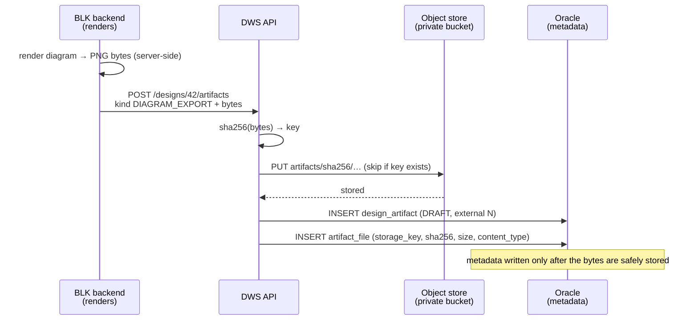
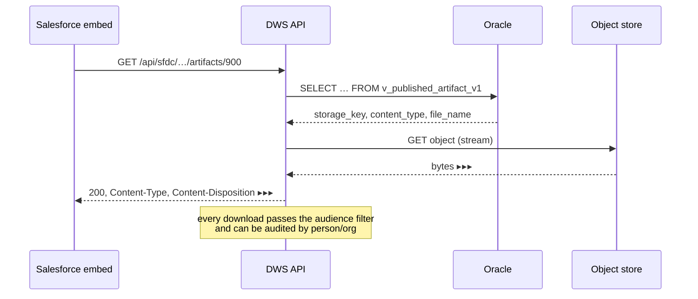

# Artifact storage

Resolves **open question 7** — *"artifact bytes in Oracle, or object storage?"*
([open-questions.md](./open-questions.md), [data-model.md](./data-model.md) §
Open questions 1).

**Decision: artifact bytes live in object storage. Oracle keeps only the
metadata and the pointer.** The `artifact_file` row stops carrying a `BLOB` and
carries a `storage_key` instead.

Companion to [architecture.md](./architecture.md) (system boundaries),
[data-model.md](./data-model.md) (the tables) and
[sfdc-artifacts-api.md](./sfdc-artifacts-api.md) (the read endpoint). This doc
owns the storage layer those three refer to.

---

## Why not the database

An artifact is a rendered file — a diagram PNG, a summary PDF, a BOM
spreadsheet. Today the POC renders it on every request and stores nothing
(`DefaultArtifactService` even re-renders each file just to measure its size,
and says so in a comment). Production has to store the bytes once. The only
question is *where*.

Oracle can hold a `BLOB`, and for a handful of small files it would work. It is
the wrong home at scale, for four reasons:

- **A presentation is megabytes; a datasheet is tens.** Large `BLOB`s bloat the
  tablespace, the redo log and every backup — the parts of Oracle that are
  most expensive to grow and slowest to restore. Backups become artifact-sized
  rather than metadata-sized.
- **Streaming a `BLOB` ties up a database connection** for the length of a
  download. A 40 MB export on a slow link holds a pooled connection for
  seconds; object storage streams without one.
- **Bytes are immutable and content-addressed** (see below). That is exactly
  what an object store is for and exactly what a relational row is not.
- **The database is the entitlement engine.** Keeping it small and fast keeps
  the *decisions* fast — who may see what — while the bytes ride a cheaper tier.

Object storage inverts every one of those: cheap capacity, native streaming,
lifecycle rules, and a clean separation between "does this file exist and may
you have it" (Oracle) and "here are the bytes" (the store).

---

## The split

Two systems of record, each owning what it is good at.

| Concern | Home | Why |
|---|---|---|
| Does this artifact exist, what is it, who may see it | **Oracle** `design_artifact` + `artifact_file` | Joins, entitlement, the publish trigger, the audit trail |
| The bytes | **Object store** | Cheap, immutable, streamable |
| The link between them | `artifact_file.storage_key` | One string; the only coupling |

Oracle remains the **system of record for existence**. A file the database does
not know about does not exist, whatever is in the bucket. The bucket is the
system of record for **content** only. This asymmetry is deliberate: it means
entitlement can never be bypassed by reaching the store directly (the store is
private and unlisted), and an orphaned blob is harmless — invisible until a
metadata row points at it.

---

## Addressing: content, not name

The storage key is derived from the bytes, not from the design or the file
name:

```
artifacts/sha256/<first-2>/<next-2>/<full-64-hex>
                  ▲          ▲        ▲
                  fan-out for the store's own sharding; the sha256 is the id
```

`artifact_file.sha256` already exists in the model "for dedupe + integrity" —
this makes it the address as well. Content addressing buys three things for
free:

- **Deduplication.** Re-export a diagram that did not change and the bytes hash
  to the same key; the store already has them, so the second write is a no-op.
  Two designs that produce an identical BOM share one blob.
- **Integrity.** The key *is* the checksum. A read verifies itself: if the
  fetched bytes do not hash to the key, the object is corrupt, and you know
  without a second column.
- **Immutability for free.** A key never changes meaning, so a written object
  is never overwritten — which is what lets it be cached forever and lets a
  publication pin an exact file (see *Versioning*).

The key carries **no customer identity** — no opportunity id, no design name, no
part number. That matters for data residency and erasure (below): the key is
safe to log, and deleting a design is a metadata operation, not a rename of
every blob.

---

## The port

The application layer already depends on ports, not classes
([architecture.md](./architecture.md) § Layout: "dependencies point inwards").
Storage is one more:

```
com.arrow.dws.domain.port
└── ArtifactStore            put(bytes, contentType) -> StorageKey
                             open(StorageKey)        -> InputStream   (streamed)
                             presign(StorageKey, ttl)-> URL           (optional)
                             exists(StorageKey)      -> boolean
                             delete(StorageKey)       (GC only)
```

`put` is **content-addressed and idempotent**: it hashes, writes only if the key
is absent, and returns the key. Callers never choose a key.

Adapters, chosen per environment by Spring profile — the swap the port exists
for:

| Adapter | Backs onto | Used in |
|---|---|---|
| `InMemoryArtifactStore` | a `Map` | tests, and today's POC |
| `FilesystemArtifactStore` | a directory tree | local dev, single-host demo |
| `S3ArtifactStore` | S3 / MinIO (S3 API) | staging and production |

`domain` and `application` know only `ArtifactStore`. Moving from a filesystem
demo to S3 in production is a wiring change and a config block — no use case,
no tab contributor, and no test changes, exactly as the existing
`DesignRepository` swap from in-memory to JPA does not touch the rules.

MinIO speaks the S3 API, so one `S3ArtifactStore` covers MinIO on a laptop and
AWS S3 (or an internal S3-compatible tier) in production. There is no separate
MinIO adapter.

---

## Write path — producing an artifact

BLK renders (it owns GoJS), then hands DWS the bytes; DWS stores them and
records the metadata. **Bytes first, metadata second** — the ordering is what
keeps the two stores consistent.



If the metadata insert fails after the blob is written, the blob is orphaned —
harmless, and swept later (see *Orphans*). If the process dies before the blob
is written, there is no metadata row, so nothing references a missing object.
The only forbidden state — a metadata row pointing at bytes that are not there —
cannot occur, because the row is written last.

This replaces the render-on-every-request POC: after this, `listArtifacts`
reads `size_bytes` from the row and renders nothing, and `downloadArtifact`
opens the stored object instead of re-rendering. The comment in
`DefaultArtifactService` predicting exactly this can then be deleted.

---

## Read path — serving an artifact

Two ways to get bytes to a browser. They differ in who enforces entitlement.

### A. Proxy through DWS — the default

DWS reads the key from Oracle (through `v_published_artifact_v1` for the
Salesforce audience, so a draft or internal file is unreachable), opens the
object, and **streams** it back — never buffering the whole file in memory.



Entitlement is enforced on every byte, the download is auditable (who, when,
which file), and the store stays entirely private — no public URLs exist.
Cost: the bytes transit DWS. For files up to tens of MB, streamed, that is
cheap and is what the artifacts API already does.

### B. Presigned URL — the escape hatch for large files

DWS checks entitlement, then returns a **short-lived, single-object** signed URL
and lets the client fetch bytes straight from the store. Good for a 200 MB
presentation where proxying is wasteful.

Traded away: the download itself is no longer proxied, so it cannot be audited
byte-for-byte, and the URL — though short-lived and scoped to one object —
grants access for its lifetime. Because the URL leaks entitlement if it leaks,
the TTL is minutes, and it is minted only after the same `v_published_artifact_v1`
check the proxy path runs.

**Default to A.** Reach for B only when a real file size makes proxying hurt,
and record the choice per artifact kind, not globally.

---

## Versioning

`artifact_file` is already versioned (`UNIQUE (artifact_id, version_no)`), and a
publication pins `file_id` — an exact file, not "the latest". Content addressing
makes that airtight: re-exporting produces a new `artifact_file` row (a new
version) pointing at a new key, while the old row still points at the old key,
whose bytes were never overwritten. A customer who was shown v3 keeps seeing v3
until someone republishes v4, even though the diagram moved on. Nothing has to
copy or protect the old bytes — immutability did it.

---

## Consistency and cleanup

- **Orphans** (a blob with no metadata row): produced by a crash between PUT and
  INSERT, and by superseded versions once a retention window passes. A periodic
  sweep lists keys, left-joins against `artifact_file.storage_key`, and deletes
  the unreferenced ones **older than a grace period** (so a blob mid-write is
  never swept). Cheap, idempotent, and the only cleanup needed — because the
  bytes-first ordering guarantees orphans are the *only* inconsistency that can
  arise.
- **Never delete on unpublish or soft-delete.** `design_artifact.deleted_at`
  and unpublish hide a row; they do not touch the store. Erasure and the orphan
  sweep are the only things that delete bytes, so history and audit stay intact.
- **Dedup and delete interact through reference counting.** A key shared by two
  artifacts must not be deleted while either references it — the sweep's
  left-join handles this: a key is unreferenced only when *no* row points at it.

---

## Security, residency, erasure

- **Private bucket, no public access.** No object ACL is ever public; the only
  ways to bytes are the DWS proxy or a DWS-minted presigned URL. Server-side
  encryption at rest is on; TLS in transit is on.
- **Data residency** ([open-questions.md](./open-questions.md) blocker 2). One
  bucket per region — an EU design's bytes go to the EU bucket, chosen from the
  design's region at write time and recorded so reads go to the same place.
  Because the key carries no identity, the region is the only geographic fact,
  and it lives in one column.
- **Right to erasure.** Deleting a design deletes its `artifact_file` rows and
  enqueues their keys for the sweep to remove from the store — erasure is
  satisfied in Oracle immediately and in the store shortly after, and the
  key-with-no-identity means there is nothing else anywhere to scrub. Anything
  already downloaded into Salesforce is out of scope here, as
  [open-questions.md](./open-questions.md) notes.

---

## What this changes in the model

`artifact_file` ([data-model.md](./data-model.md) § artifact_file) resolves to
one body column, not two:

- **Drop** `bytes BLOB`.
- **Keep** `storage_key`, now `NOT NULL`.
- **Add** `store_region VARCHAR2(16)` — which regional bucket holds it.
- **Drop** the `ck_file_body` CHECK (there is no longer a choice to enforce).

`sha256` stays and gains a second job: it is the storage address, not only the
integrity check. `size_bytes` and `content_type` stay — they are what lets the
list endpoint answer without touching the store at all.

Nothing else in the schema moves. `design_artifact`, the publish trigger,
`artifact_publication` and `v_published_artifact_v1` are unchanged; the view
already selects `f.file_name, f.content_type, f.size_bytes` and never selected
the bytes.

---

## What stays open

- **Which S3 tier** — AWS S3, an internal S3-compatible object store, or MinIO
  on-prem — is a procurement/infra decision, not a design one. The
  `S3ArtifactStore` adapter covers all three.
- **Presign vs proxy per kind**: default proxy; revisit if a kind's real files
  are routinely large enough to hurt.
- **Cross-region replication** for DR is an infra policy on the bucket, invisible
  to this design.

These do not block building against the port; they are settings on the adapter
it hides.
